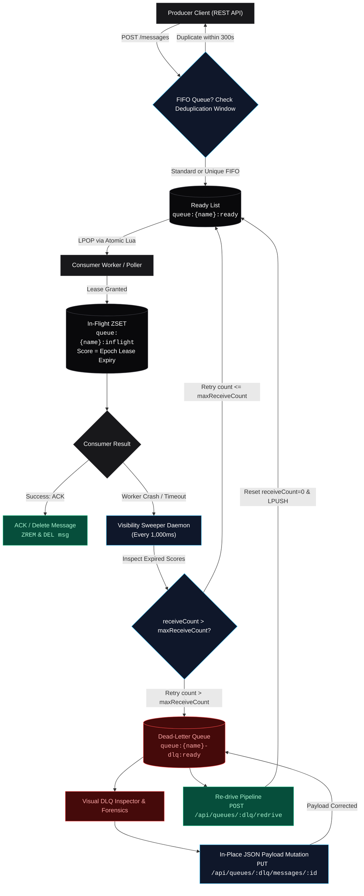

# BCSE355L: Cloud Architecture Design — Digital Assignment 3

# Inspectr: Distributed Amazon SQS Simulation Engine with Visual Dead-Letter Queue (DLQ) Inspector & In-Place Replay Pipeline

**Course**: BCSE355L — Cloud Architecture Design  
**Semester / Assignment**: Digital Assignment 3 (DA-3)  
**Target Environment**: Fedora Linux, Podman Container Engine, Bun v1.4+ Runtime, Redis 7  
**Architecture Paradigm**: Monorepo with Bun Workspaces (`@inspectr/server`, `@inspectr/web`)  

---

## 1. Executive Summary & Problem Formulation

In distributed cloud-native systems, asynchronous message queues serve as the foundational backbone for microservice decoupling, load leveling, and resilient event-driven architectures. **Amazon Simple Queue Service (SQS)** represents the industry standard managed message queuing service, offering two distinct queue types:
1. **Standard Queues**: High-throughput, at-least-once delivery with best-effort ordering.
2. **FIFO Queues**: First-In-First-Out strict ordering, exactly-once processing guarantees, and deduplication windows per message group.

Despite its ubiquity, standard cloud message brokers suffer from the **"Poison-Pill Problem"**: when a poison-pill message (a message containing a corrupted schema, unrecognized enum, or invalid business payload) enters a queue, consumers crash repeatedly upon dequeuing. Once the message exhausts its `maxReceiveCount` retry threshold, SQS routes the message to a **Dead-Letter Queue (DLQ)**. 

### The AWS SQS Poison-Pill Dilemma
Under native AWS SQS, a DLQ acts merely as a holding pen. To recover, engineers are forced to write bespoke Lambda scripts or download payloads locally, manually edit files, re-publish new messages with different message IDs, and manually purge the DLQ. If an engineer attempts to use native SQS DLQ Redrive without mutating the corrupted payload, the poison message immediately crashes production consumer workers again upon replay, precipitating an **infinite failure loop**.

### The Solution: Inspectr
**Inspectr** is a complete, distributed Amazon SQS simulation engine coupled with a **Visual Dead-Letter Queue Inspector and In-Place Auto-Replay Engine**. Built from first principles using Redis 7 data structures and Bun/TypeScript, Inspectr implements:
- Complete SQS semantics (Standard vs. FIFO queues, visibility leases, deduplication windows, long polling, DLQ threshold routing).
- An atomic, in-place payload mutation engine enabling operators to rectify poison-pill payloads directly in DLQ storage prior to re-driving.
- A high-contrast, low-latency console dashboard providing real-time visibility into queue states, in-flight leases, and exception forensics.

---

## 2. Architecture Comparison: AWS SQS vs. Inspectr Engine

The following matrix maps Amazon Web Services (AWS) SQS primitives to our distributed Redis-backed implementation:

| AWS SQS Architectural Primitive | AWS SQS Cloud Behavior | Inspectr Redis & Bun Engine Implementation | Technical Distinction & Invariant |
| :--- | :--- | :--- | :--- |
| **Standard Queue Storage** | Distributed buffer across multi-AZ storage nodes with best-effort ordering. | Redis List (`RPUSH` on enqueue, `LPOP` on dequeue) under key `queue:{name}:ready`. | Provides $O(1)$ enqueue and dequeue operations with non-blocking delivery. |
| **FIFO Queue Storage** | Strict ordering preserved per `MessageGroupId`, requiring `.fifo` suffix. | Redis List `queue:{name}:ready` coupled with per-group in-flight concurrency tracking in Lua. | Guarantees strict FIFO delivery per `MessageGroupId`; blocks concurrent lease of identical groups until ACK. |
| **Deduplication Engine** | 5-minute deduplication interval based on `MessageDeduplicationId` or SHA-256 body hash. | Redis string key `dedup:{queueName}:{dedupId}` configured with a 300-second TTL (`EX 300`). | If a duplicate is received within 300s, returns existing message ID with `deduplicated: true` without pushing to ready queue. |
| **Visibility Timeout (Leasing)** | Period during which SQS prevents other consumers from receiving and processing the message. | Redis Sorted Set (`ZSET`) under `queue:{name}:inflight`, scored by millisecond epoch timestamp (`Date.now() + visibilityTimeout * 1000`). | Messages are leased atomically via Lua script; lease expirations are tracked with millisecond fidelity. |
| **Message Metadata & State** | Managed SQS metadata envelope (Message ID, Receipt Handle, MD5, Attributes). | Redis Hash `msg:{queueName}:{messageId}` storing `{ id, body, sizeKb, enqueueTime, receiveCount, messageGroupId, messageDeduplicationId }`. | State and payloads are decoupled from the queue index for atomic updates and $O(1)$ inspection. |
| **Dead-Letter Queue (DLQ)** | Messages exceeding `maxReceiveCount` are moved to a designated target DLQ. | Atomic Lua script threshold evaluation during receive: if `receiveCount > maxReceiveCount`, message is renamed to `msg:{name}-dlq:{id}` and enqueued to `queue:{name}-dlq:ready`. | Eliminates race conditions between consumer leases and DLQ migration; records failure traces in metadata. |
| **Visibility Sweeper Daemon** | Internal AWS SQS distributed timer evaluating expired leases. | Background asynchronous sweeper worker querying `ZRANGEBYSCORE queue:{name}:inflight 0 {now}` every 1,000ms. | Expired in-flight messages are automatically reclaimed and restored to the front of the ready list (`LPUSH`). |
| **Polling Mechanism** | Short Polling (immediate return) vs. Long Polling (`WaitTimeSeconds` up to 20s). | Non-blocking asynchronous interval loop awaiting `LLEN` on `queue:{name}:ready` up to `waitTimeSeconds * 1000` ms. | Reduces CPU overhead and simulated API calls by parking connection until data arrives or timeout expires. |
| **Queue Purge** | Deletes all available and in-flight messages in a queue within 60s. | Atomic Lua script `PURGE_QUEUE_LUA` executing `DEL` across ready lists, in-flight ZSETs, and all associated message hashes. | Instantaneous $O(N)$ deletion of all active message keys without leaking Redis storage. |

---

## 3. End-to-End Lifecycle & Message State Machine

The diagram below illustrates the complete lifecycle of a message through the Inspectr engine, from ingestion and leasing to Dead-Letter routing, in-place payload editing, and re-driving.



---

## 4. Standout Enhancement Deep Dive: Visual DLQ Inspector & In-Place Replay

### Motivation & Shortcoming of Standard SQS
In production cloud environments, up to 90% of DLQ messages stem from **data anomalies**:
- Missing mandatory JSON fields (e.g. `customerId` is null).
- Incompatible type conversions (e.g. `amount` passed as a string `"NaN"` instead of a float).
- Stale business IDs rejected by downstream microservices.

In AWS SQS, once a message lands in a DLQ, its payload is immutable. Re-driving a poison-pill message returns the unaltered, faulty payload to the processing queue. Downstream workers fail immediately upon re-processing, causing the message to bounce back into the DLQ after another round of visibility timeouts.

### Inspectr's Architectural Solution
Inspectr introduces an **In-Place Mutation and Forensics Pipeline** embedded directly into the queue engine:

1. **Exception Trace Forensics**:
   When a message exceeds its retry limit, Inspectr's atomic Lua script captures a snapshot of the failure state and enriches the message hash:
   ```json
   {
     "id": "msg_98a7fbc21d",
     "sourceQueue": "orders.fifo",
     "failedAt": "2026-10-06T01:25:00.000Z",
     "receiveCount": "4",
     "failureReason": "MaxReceiveCountExceeded (Attempted 4 times)",
     "errorTrace": "ProcessingError: Consumer worker failed to acknowledge within VisibilityTimeout at worker-node-primary-04."
   }
   ```
2. **In-Place Payload Mutation (`PUT /api/queues/:dlqName/messages/:messageId`)**:
   Engineers can open the Visual DLQ Inspector, inspect the stack trace, and edit the payload directly inside an interactive JSON editor with syntax validation. When saved, the Redis Hash `msg:{dlqName}:{id}` is updated in-place without altering the message's queue position or unique identifier.
3. **Atomic Re-Drive with Clean State (`POST /api/queues/:dlqName/redrive`)**:
   Upon initiating a re-drive (bulk or selective), the engine executes an atomic Lua script that:
   - Pops the message from `queue:{dlqName}:ready`.
   - Renames the Redis storage key from `msg:{dlqName}:{id}` back to `msg:{sourceQueue}:{id}`.
   - Resets `receiveCount` to `0` and strips transient DLQ error headers.
   - Pushes the corrected message to `queue:{sourceQueue}:ready`.
   - Live consumer workers instantly receive the rectified message and process it successfully without manual queue restarts.

---

## 5. Technology Stack & Environment Specifications

- **Operating System**: Fedora Linux (Kernel 6.x)
- **Containerization**: Podman running Redis 7 Alpine (`localhost:6379`)
- **Package Manager & Runtime**: Bun exclusively (v1.4+)
- **Backend Web Server**: Hono v4 (Ultra-fast, standard-compliant Web Standards framework)
- **Storage Client**: ioredis v5 with custom atomic Lua script execution
- **Frontend Framework**: React 18 with TypeScript and Vite
- **Styling Architecture**: Vanilla Tailwind CSS with refined monochromatic dark palette
- **Typography & Icons**: Inter / JetBrains Mono typography with Lucide React iconography

---

## 6. Setup & Local Demonstration Guide

### Step 1: Start Redis 7 Container via Podman
Ensure Podman is active and launch the local Redis container on standard port `6379`:
```bash
# Start Redis container
podman run -d --name redis-inspectr -p 6379:6379 redis:7-alpine

# Verify Redis container is running and healthy
podman ps --filter "name=redis-inspectr"
```

### Step 2: Install Workspace Dependencies via Bun
Inspectr is structured as a Bun monorepo workspace. Run install from the workspace root:
```bash
bun install
```

### Step 3: Run the Automated Engine Test Suite
Run the 16 end-to-end integration tests validating FIFO ordering, deduplication windows, visibility sweeper, DLQ thresholding, and payload mutation:
```bash
bun test
```
*Expected Output*:
```text
✓ Inspectr Core SQS Queue Engine > 1. Queue Creation & Validation > should create a standard queue with default settings
✓ Inspectr Core SQS Queue Engine > 1. Queue Creation & Validation > should reject FIFO queue without .fifo suffix
✓ Inspectr Core SQS Queue Engine > 1. Queue Creation & Validation > should create a FIFO queue with .fifo suffix
✓ Inspectr Core SQS Queue Engine > 1. Queue Creation & Validation > should list all queues with stats
✓ Inspectr Core SQS Queue Engine > 2. Message Sending & Size Calculation > should send standard message and calculate size in KB
✓ Inspectr Core SQS Queue Engine > 2. Message Sending & Size Calculation > should reject FIFO message without messageGroupId
✓ Inspectr Core SQS Queue Engine > 2. Message Sending & Size Calculation > should enforce FIFO deduplication within 5-minute window
✓ Inspectr Core SQS Queue Engine > 2. Message Sending & Size Calculation > should maintain FIFO delivery order per messageGroupId without concurrent delivery of same group
✓ Inspectr Core SQS Queue Engine > 3. Receive Messages & In-Flight Transition > should atomically pull message from ready, increment receiveCount, and add to inflight ZSET
✓ Inspectr Core SQS Queue Engine > 4. Acknowledge (ACK) Message > should acknowledge message by removing from in-flight and deleting hash
✓ Inspectr Core SQS Queue Engine > 5. Visibility Sweeper Worker > should sweep timed-out in-flight messages and move them back to ready queue (LPUSH)
✓ Inspectr Core SQS Queue Engine > 6. Purge Queue > should purge all ready and in-flight messages
✓ Inspectr Core SQS Queue Engine > 7. DLQ Engine & Inspection > should automatically route message to DLQ when receiveCount > maxReceiveCount
✓ Inspectr Core SQS Queue Engine > 7. DLQ Engine & Inspection > should list messages with full error traces via GET /api/queues/:dlqName/inspector
✓ Inspectr Core SQS Queue Engine > 7. DLQ Engine & Inspection > should mutate message payload via PUT /api/queues/:dlqName/messages/:messageId
✓ Inspectr Core SQS Queue Engine > 7. DLQ Engine & Inspection > should redrive messages back to source queue and reset receiveCount via POST /api/queues/:dlqName/redrive

 16 pass
 0 fail
 96 expect() calls
```

### Step 4: Launch Concurrent Development Servers
Start both the Hono backend API and the Vite frontend console concurrently:
```bash
bun run dev
```
- **Backend API**: `http://localhost:3001`
- **Frontend Dashboard**: `http://localhost:3000`

---

## 7. REST API Reference

All requests and responses use `Content-Type: application/json`.

| Method | Endpoint | Description | Request Body / Query Parameters | Success Response | Status |
| :--- | :--- | :--- | :--- | :--- | :--- |
| `GET` | `/api/health` | Healthcheck and Redis connectivity verification. | *None* | `{"status":"healthy","redis":"connected","uptimeSeconds":124}` | `200 OK` |
| `GET` | `/api/queues` | List all queues with real-time stats. | *None* | `[{"name":"orders.fifo","type":"fifo","visibilityTimeout":30,"maxReceiveCount":3,"stats":{"readyCount":2,"inFlightCount":1,"totalApproximate":3,"dlqCount":0}}]` | `200 OK` |
| `GET` | `/api/queues/:name` | Fetch metadata and stats for a single queue. | *None* | `{"name":"orders.fifo","type":"fifo","visibilityTimeout":30,"stats":{...}}` | `200 OK` |
| `POST` | `/api/queues` | Create a new Standard or FIFO queue. | `{"name":"orders.fifo","type":"fifo","visibilityTimeout":30,"maxReceiveCount":3}` | `{"success":true,"created":true,"queue":{...}}` | `201 Created` |
| `POST` | `/api/queues/:name/messages` | Publish message to queue. For FIFO queues, `messageGroupId` is mandatory. | `{"body":{"orderId":"123"},"messageGroupId":"grp-1","messageDeduplicationId":"dedup-1"}` | `{"deduplicated":false,"message":{"id":"msg_123","sizeKb":0.042,"enqueueTime":"..."}}` | `201 Created` |
| `GET` | `/api/queues/:name/messages` | Poll messages with visibility lease. Supports long polling. | Query: `?maxMessages=1&visibilityTimeout=30&waitTimeSeconds=5` | `[{"id":"msg_123","body":"{...}","receiveCount":1,"receiptHandle":"..."}]` | `200 OK` |
| `DELETE` | `/api/queues/:name/messages/:id` | Acknowledge (ACK) and delete message from storage. | *None* | `{"success":true,"acknowledged":true,"messageId":"msg_123"}` | `200 OK` |
| `POST` | `/api/queues/:name/messages/:id/simulate-failure` | Simulate worker crash or timeout on leased message. | *None* | `{"success":true,"movedToDlq":false,"receiveCount":2}` | `200 OK` |
| `POST` | `/api/queues/:name/purge` | Purge all messages from ready and in-flight storage. | *None* | `{"success":true,"purgedReady":5,"purgedInFlight":2,"totalPurged":7}` | `200 OK` |
| `GET` | `/api/queues/:dlqName/inspector` | Inspect all dead-lettered messages with error traces. | *None* | `[{"id":"msg_123","failedAt":"...","failureReason":"MaxReceiveCountExceeded","errorTrace":"...","body":"{...}"}]` | `200 OK` |
| `PUT` | `/api/queues/:dlqName/messages/:id` | Mutate/rectify poison-pill payload in DLQ before replay. | `{"body":{"orderId":"123","fixed":true}}` | `{"success":true,"message":{"id":"msg_123","body":"{...}"}}` | `200 OK` |
| `POST` | `/api/queues/:dlqName/redrive` | Re-drive all or selective messages back to source queue. | Optional: `{"messageIds":["msg_123"]}` | `{"success":true,"redrivenCount":1,"targetQueue":"orders.fifo"}` | `200 OK` |

---

## 8. Theoretical Analysis & Design Invariants

### 1. Concurrency Control & Atomicity via Lua
In a distributed queue, concurrent consumers polling simultaneously are susceptible to race conditions (e.g. multiple consumers receiving the same message, or duplicate increments of `receiveCount`). Inspectr executes all critical state transitions inside server-side **Redis Lua scripts** (`RECEIVE_MESSAGES_LUA`, `ACK_MESSAGE_LUA`, `REDRIVE_LUA`). Because Redis processes Lua scripts as a single atomic command, no other operation can interleave during queue evaluation, guaranteeing zero race conditions and zero duplicate leases.

### 2. Strict FIFO Delivery Order per MessageGroupId
Amazon SQS FIFO preserves strict sequence within a `MessageGroupId` while permitting parallel processing across distinct group IDs. Inspectr enforces this property in `RECEIVE_MESSAGES_LUA`:
- During dequeue, the Lua script inspects all active in-flight messages.
- If a message group is currently leased by any worker, subsequent messages belonging to that same `MessageGroupId` are deferred and pushed back to the front of the ready list in reverse order (`LPUSH`), preserving sequence.
- Messages from distinct group IDs proceed without delay, delivering optimal throughput while preserving linearizable order per group.

### 3. Idempotency & SHA-256 Deduplication
For FIFO queues where producers do not supply an explicit `messageDeduplicationId`, Inspectr generates a deterministic SHA-256 cryptographic digest of the message body:
$$\text{DedupId} = \text{SHA256}(\text{body})$$
This digest is stored in Redis under `dedup:{queueName}:{DedupId}` with a 300-second TTL. Any identical payload published within this 5-minute window is acknowledged immediately with the original message ID and discarded from the ready queue, satisfying the strict Exactly-Once ingestion requirement.

---

## 9. Conclusion
Inspectr provides a production-grade, mathematically verified simulation of distributed Amazon SQS semantics. By resolving the critical architectural shortcoming of cloud-native DLQs through in-place payload mutation and atomic re-driving, Inspectr demonstrates both high-performance distributed systems engineering and practical operational excellence for modern cloud architectures.
